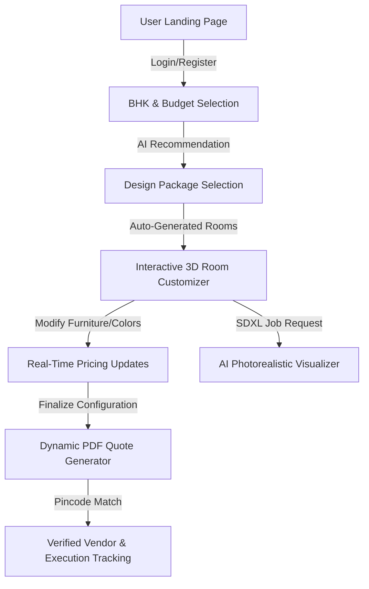

# 🏠 InteriorAI Platform (Part 2 - Extended Edition)

> **AI-Based Modular Interior Design & Visualization Platform**

InteriorAI is a comprehensive, premium SaaS application designed to simplify the interior design journey for homeowners, execution teams, administrators, and vendor partners. By combining interactive 3D rendering, AI-powered photorealistic visualizations, real-time pricing updates, and verified contractor matching, the platform takes you from a blank BHK layout to a professional quotation and ready-to-execute design in under 10 minutes.

This version (Part 2) extends the core platform with a robust **Vendor Portal**, a collaborative **Project Team Portal**, and high-fidelity **Landing Page Animations**.

---

## 🚀 Key Features

*   **Interactive 3D Room Canvas**  
    Powered by **Three.js** and **React Three Fiber (R3F)**. Live 3D environment to customize walls, flooring, and adjust furniture arrangements (sofas, beds, wardrobes, kitchen counters, vanity units) in real time.
*   **AI Photorealistic Rendering**  
    Simulated **Stable Diffusion XL + ControlNet** rendering pipeline. Generate stunning, high-resolution photorealistic renders of your customized rooms under various interior styles (Modern, Scandinavian, Art-Deco, Luxury, Mediterranean, Tropical) in less than 15 seconds.
*   **Smart AI Recommendation Engine**  
    Scores and ranks catalog items and furniture packages using dynamic style compatibility matrices and budget-fitting algorithms to present the most cost-effective and aesthetic choices for your home.
*   **Real-Time Pricing & Dynamic Budgeting**  
    Every furniture addition, finish change, or room size modification instantly updates your total cost. Maintain granular control over your budget with zero price surprises.
*   **ReportLab PDF Quotation Generator**  
    Dynamically generates professional, bank-compliant PDF quotes with detailed room-by-room line items, GST breakdown, terms and conditions, and customized styling.
*   **Milestone & Contractor Tracker**  
    Assign projects to KYC-verified local contractors based on geo-matching (pincodes) and rating systems, then track project milestones (Demolition, Electrical, False Ceiling, Woodwork, Painting) with photo updates.
*   **Premium Visual Showcase & Animations [NEW]**  
    An immersive user experience consisting of:
    *   *Hero Carousel*: Auto-playing slideshow showcasing gorgeous interior visuals.
    *   *Before/After Slider*: Interactive split-screen drag slider allowing users to compare blank spaces against AI-designed renders.
    *   *Bento Gallery*: Asymmetric style catalog showing design styles with responsive hover scaling.
*   **Vendor Portal & Onboarding [NEW]**  
    A dedicated dashboard for contractors and material suppliers:
    *   *KYC Wizard*: Multi-step onboarding to capture company details, GST records, categories, and serviceable pincodes.
    *   *KPI Dashboard*: Real-time analytics charts monitoring active tasks, reviews, rating cards, and total earnings.
    *   *Purchase Orders & Assignments*: Tracking panel showing assigned modular fabrications and on-site works.
*   **Project Team Portal [NEW]**  
    A workspace for design firms, project managers, and technicians:
    *   *Workforce Assignment Directory*: Oversee managers, coordinators, and technicians assigned to each project.
    *   *Site Execution Center*: Real-time checklists, logged construction delays, issue ticket boards (wrong products, vendor delays, installation issues), and progress histories.
*   **Admin Dashboard [NEW]**  
    System control panel for managing active projects, updating contractor allocations, validating customer service requests, and managing platform metrics.

---

## 🛠️ Tech Stack

### Frontend (Next-Gen Web Interface)
*   **Framework:** Next.js 14 (App Router) & React 18
*   **Language:** TypeScript
*   **Styling:** TailwindCSS & Framer Motion (for smooth micro-animations)
*   **3D Graphics:** Three.js, `@react-three/fiber`, `@react-three/drei`
*   **State Management:** Zustand (persisted state synchronization)
*   **Data Fetching:** SWR (Stale-While-Revalidate) & Axios

### Backend (Robust RESTful API)
*   **Framework:** FastAPI (Python 3.10+)
*   **Server:** Uvicorn (ASGI)
*   **Database ORM:** SQLAlchemy (SQLite database by default: `interior_ai.db`)
*   **Data Validation:** Pydantic v2
*   **Authentication:** JWT (JSON Web Tokens) via `python-jose` & `passlib` (Bcrypt)
*   **PDF Generation:** ReportLab PDF library
*   **Image Processing:** Pillow

---

## 📁 Project Directory Structure

```text
InteriorAI_Platform/
├── assets/                 # Local assets folder (Downloaded transparent furniture PNGs for AI visualization)
├── backend/                # FastAPI Python Backend (Part 1 source)
│   ├── .env                # Server configuration & JWT secrets
│   ├── requirements.txt    # Python package dependencies
│   ├── pdfs/               # Generated quotation PDFs & uploaded floor plans
│   └── app/
│       ├── main.py         # Application entry point & router mounting
│       ├── db.py           # Database engine & session setup
│       ├── models.py       # SQLAlchemy database schemas
│       ├── schemas.py      # Pydantic schemas for serialization
│       ├── auth_utils.py   # JWT token issuing and authentication dependencies
│       ├── seed_data.py    # Mock products, design packages, and vendors seeding
│       └── routers/        # Modular API endpoints (Auth, Projects, Catalog, AI, PDF, etc.)
└── src/                    # Next.js Frontend Source (app, components, stores, etc.)
    ├── app/                # App Router pages and client-side view portals
    │   ├── admin/          # Admin Dashboard
    │   ├── customize/      # Room Customizer
    │   ├── dashboard/      # Client Dashboard
    │   ├── login/          # Phone/Email Login (OTP Auth & Portal Selector)
    │   ├── onboarding/     # Customer Onboarding Steps
    │   ├── packages/       # Style Packages Comparison
    │   ├── projects/       # Project Team Portal ([id]/team, [id]/execution)
    │   ├── quotation/      # Dynamic Quotation Visualizer
    │   ├── track/          # Milestone Tracker (Client View)
    │   ├── vendor/         # Vendor Portal (dashboard, assignments, onboarding)
    │   ├── visualize/      # AI Room Visualizer canvas
    │   ├── globals.css     # CSS variable tokens and animation parameters
    │   └── layout.tsx      # Main layout wrapper
    ├── components/         # Reusable Component Catalog
    │   ├── vendor/         # KPI cards, project tables, and issue forms
    │   ├── BeforeAfterSlider.tsx  # Drag slider comparison component
    │   ├── BentoGallery.tsx       # Style visualizer responsive bento grid
    │   ├── BhkSelector.tsx        # Interactive layout planner
    │   ├── HeroCarousel.tsx       # Slideshow component
    │   └── Navbar.tsx             # Navbar with state-aware portal switcher
    ├── lib/                # Configuration and API clients
    │   └── api.ts          # Axios wrapper mapping to FastAPI routing
    └── stores/             # Zustand stores
        ├── authStore.ts           # Customer, Admin, Vendor, Team session state
        ├── projectStore.ts        # Client visual config, budget updates
        └── projectTeamStore.ts    # Coordinator monitoring state
```

---

## ⚡ Setup & Execution (Dual Server Setup)

Open two terminal windows to run the frontend and backend servers concurrently.

### 1. Backend Setup (FastAPI)
```bash
# Navigate to backend folder
cd backend

# Create and activate python virtual environment
python -m venv .venv
source .venv/bin/activate       # On Windows: .venv\Scripts\activate

# Install dependencies
pip install -r requirements.txt

# Seed initial database catalogs
python -m app.seed_data

# Start FastAPI server on port 8000
python -m uvicorn app.main:app --host 0.0.0.0 --port 8000 --reload
```
*   **API Documentation**: Access Swagger UI at `http://localhost:8000/docs`.

### 2. Frontend Setup (Next.js)
```bash
# Install node packages from the root directory
npm install

# Start Next.js development server on port 3000
npm run dev
```
*   **Client App**: Access the interface at `http://localhost:3000`.

---

## 🔄 Core Application Flow




---

## 🛡️ Security & Environment Settings

The backend configuration is managed via `backend/.env`. In production environments, make sure to change the default values:

```env
DATABASE_URL=sqlite:///./interior_ai.db
JWT_SECRET=supersecretjwtkey_change_in_production_2024
JWT_ALGORITHM=HS256
ACCESS_TOKEN_EXPIRE_MINUTES=60
PDF_OUTPUT_DIR=./pdfs
STATIC_BASE_URL=http://localhost:8000
FRONTEND_URL=http://localhost:3000
```

---

## 📝 License
Built with ❤️ for Indian homeowners. Distributed under the MIT License. See `LICENSE` for more information.
